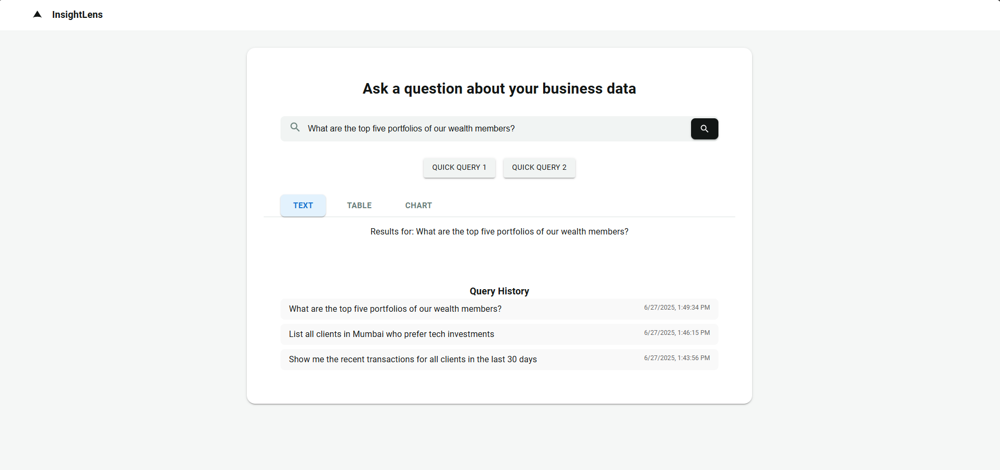
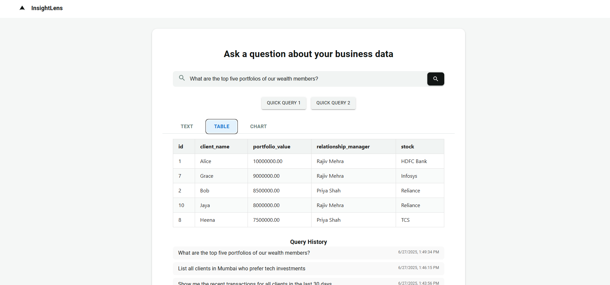
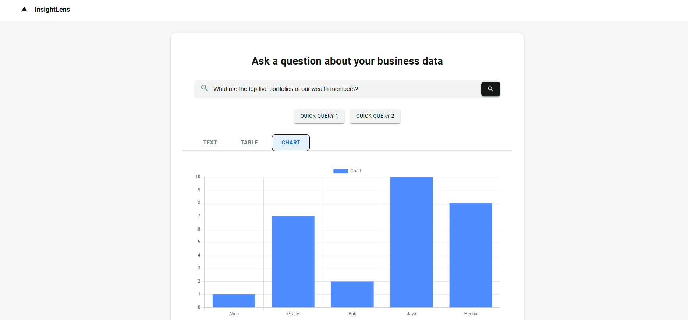
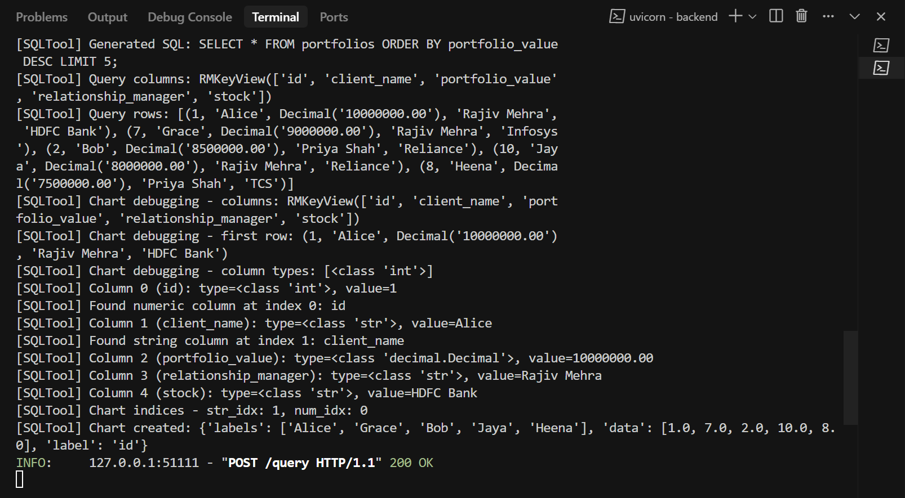

# InsightLens - Natural Language Cross-Platform Data Query RAG Agent

A modern, full-stack business intelligence platform that enables users to query multiple data sources using natural language and receive answers in text, tables, and interactive charts.

**Frontend:** React (Vite) + Material-UI + Chart.js  
**Backend:** FastAPI + LangChain + OpenRouter LLM  
**Databases:** MongoDB (client profiles) + MySQL (portfolio data)

---

## Features

### 🤖 AI-Powered Query Processing
- **Natural Language Understanding:** Ask questions in plain English
- **Multi-Database Support:** Query both MongoDB and MySQL simultaneously
- **Intelligent Classification:** Automatically routes queries to appropriate database
- **LangChain Integration:** Advanced RAG (Retrieval-Augmented Generation) capabilities

### 📊 Rich Data Visualization
- **Text Responses:** Natural language explanations of query results
- **Interactive Tables:** Sortable, responsive data tables
- **Dynamic Charts:** Automatic chart generation with Chart.js
- **Tabbed Interface:** Switch between text, table, and chart views

### 🎯 Business Intelligence
- **Client Profiles:** Query client risk levels, preferences, demographics
- **Portfolio Analytics:** Analyze portfolio values, relationship managers, stock holdings
- **Real-time Data:** Live database connections for up-to-date insights
- **Query History:** Track and review previous queries

### 🚀 Modern UI/UX
- **Responsive Design:** Works seamlessly on desktop, tablet, and mobile
- **Material-UI Components:** Professional, accessible interface
- **Loading States:** Visual feedback during query processing
- **Error Handling:** Graceful error messages and fallbacks

---

## App Screenshots

### 1. Main Interface

*Clean, modern interface with natural language query input and quick query buttons.*

### 2. Table View

*Structured data presentation with sortable columns and responsive design.*

### 3. Chart Visualization

*Interactive charts automatically generated from query results.*

### 4. Query History

*Track and review previous queries with timestamps.*

---

## Getting Started

### Prerequisites
- **Node.js** (v18 or higher)
- **Python** (3.11 or higher)
- **MongoDB** (local or Atlas)
- **MySQL** (local or cloud)
- **OpenRouter API Key** (for LLM access)

### 1. Clone the Repository
```sh
git clone https://github.com/devp128/InsightLens.git
cd InsightLens
```

### 2. Setup Environment Variables

#### Backend (`backend/.env`)
```env
# Database Connections
MONGODB_URI=mongodb://localhost:27017/
MYSQL_HOST=localhost
MYSQL_USER=your_mysql_user
MYSQL_PASSWORD=your_mysql_password
MYSQL_DATABASE=portfolios

# LLM Configuration
OPENROUTER_API_KEY=your_openrouter_api_key

# Server Configuration
PORT=8000
HOST=0.0.0.0
```

#### Frontend (`frontend/.env`)
```env
VITE_BACKEND_URL=http://localhost:8000
```

### 3. Install Dependencies

#### Backend
```sh
cd backend
python -m venv venv
source venv/bin/activate  # On Windows: venv\Scripts\activate
pip install -r requirements.txt
```

#### Frontend
```sh
cd frontend
npm install
```

### 4. Setup Databases

#### MongoDB Setup
```sh
# Start MongoDB (if local)
mongod

# The backend will automatically create collections and populate sample data
```

#### MySQL Setup
```sh
# Create database and tables
mysql -u root -p
CREATE DATABASE portfolios;
USE portfolios;

# The backend will automatically create tables and populate sample data
```

### 5. Run the Application

#### Backend
```sh
cd backend
uvicorn main:app --reload --host 0.0.0.0 --port 8000
```

#### Frontend
```sh
cd frontend
npm run dev
```

Visit `http://localhost:5173` to access the application.

---

## Project Structure

```
InsightLens/
├── frontend/                 # React frontend application
│   ├── src/
│   │   ├── App.jsx          # Main application component
│   │   ├── App.css          # Application styles
│   │   └── main.jsx         # Application entry point
│   ├── package.json         # Frontend dependencies
│   └── vite.config.js       # Vite configuration
├── backend/                  # FastAPI backend application
│   ├── main.py              # FastAPI entry point
│   ├── schemas.py           # Pydantic data models
│   ├── requirements.txt     # Python dependencies
│   ├── db/                  # Database connectors
│   │   ├── mongo.py         # MongoDB connection
│   │   ├── mysql.py         # MySQL connection
│   │   ├── populate_mongo.py # Sample MongoDB data
│   │   └── populate_mysql.py # Sample MySQL data
│   └── langchain_agent/     # AI/LLM components
│       ├── mongo_tool.py    # MongoDB query tool
│       ├── sql_tool.py      # SQL query tool
│       └── sql_generator.py # SQL generation logic
└── README.md               # This file
```

---

## API Endpoints

### POST `/query`
Query the databases using natural language.

**Request:**
```json
{
  "query": "Show me high risk clients in Mumbai"
}
```

**Response:**
```json
{
  "text": "Found 3 high risk clients in Mumbai...",
  "table": {
    "columns": ["name", "risk", "age", "city"],
    "rows": [["Alice", "High", 45, "Mumbai"]]
  },
  "chart": {
    "labels": ["Alice", "Bob", "Charlie"],
    "data": [45, 52, 38],
    "label": "age"
  }
}
```

### GET `/health`
Health check endpoint.

---

## Deployment

### Frontend Deployment (Vercel)
1. Connect your GitHub repository to Vercel
2. Set environment variable `VITE_BACKEND_URL` to your backend URL
3. Deploy automatically on push to main branch

### Backend Deployment (Render)
1. Connect your GitHub repository
2. Set all environment variables from `backend/.env`
3. Set build command: `pip install -r requirements.txt`
4. Set start command: `uvicorn main:app --host 0.0.0.0 --port $PORT`

### Database Setup
- **MongoDB Atlas:** Create cluster and get connection string
- **MySQL:** Use PlanetScale, Railway, or AWS RDS
- Update environment variables with production database URLs

---

## Example Queries

### Client Profile Queries (MongoDB)
- "Show me the recent transactions for all clients in the last 30 days."
- "List all clients in Mumbai who prefer tech investments."
- "Which clients are classified as high risk?"

### Portfolio Queries (MySQL)
- "What are the top five portfolios of our wealth members?"
- "Give me the breakup of portfolio values per relationship manager."
- "Tell me the top relationship managers in my firm"
- "Which clients are the highest holders of HDFC?"

---

## Technology Stack

### Frontend
- **React 19** - Modern React with hooks
- **Vite** - Fast build tool and dev server
- **Material-UI** - Professional UI components
- **Chart.js** - Interactive data visualization
- **Axios** - HTTP client for API calls

### Backend
- **FastAPI** - Modern Python web framework
- **LangChain** - LLM orchestration framework
- **OpenRouter** - LLM API provider
- **SQLAlchemy** - Database ORM
- **Pymongo** - MongoDB driver

### Databases
- **MongoDB** - Document database for client profiles
- **MySQL** - Relational database for portfolio data

---

## Development

### Adding New Query Types
1. Update the classifier prompt in `main.py`
2. Add new tools in `langchain_agent/`
3. Update database schemas and sample data

### Customizing UI
1. Modify `frontend/src/App.jsx` for layout changes
2. Update `frontend/src/App.css` for styling
3. Add new chart types in the chart rendering section

### Database Schema Changes
1. Update sample data in `backend/db/populate_*.py`
2. Modify tool prompts in `langchain_agent/`
3. Update validation logic in tools

---

## Troubleshooting

### Common Issues

**Backend Connection Error:**
- Check if backend is running on correct port
- Verify `VITE_BACKEND_URL` in frontend `.env`
- Ensure CORS is properly configured

**Database Connection Issues:**
- Verify database credentials in backend `.env`
- Check if databases are running and accessible
- Ensure sample data is populated

**LLM Query Failures:**
- Verify OpenRouter API key is valid
- Check API rate limits
- Review query classification logic

### Debug Mode
Enable debug logging by setting environment variable:
```env
DEBUG=true
```

---

## Future Enhancements

### Planned Features
- **Advanced Analytics:** More chart types and statistical analysis
- **Query Templates:** Pre-built query templates for common use cases
- **Export Functionality:** Export results to CSV, PDF, or Excel
- **User Authentication:** Multi-user support with role-based access
- **Real-time Updates:** WebSocket support for live data updates
- **Mobile App:** React Native mobile application

### Technical Improvements
- **Caching:** Redis integration for query result caching
- **Rate Limiting:** API rate limiting and usage tracking
- **Monitoring:** Application performance monitoring
- **Testing:** Comprehensive unit and integration tests
- **Docker:** Containerized deployment with Docker Compose

---

## Contributing

1. Fork the repository
2. Create a feature branch (`git checkout -b feature/amazing-feature`)
3. Commit your changes (`git commit -m 'Add amazing feature'`)
4. Push to the branch (`git push origin feature/amazing-feature`)
5. Open a Pull Request

---

## License

This project is licensed under the MIT License - see the [LICENSE](LICENSE) file for details.

---

## Support

For support and questions:
- Create an issue on GitHub
- Check the troubleshooting section
- Review the example queries

---

**Built with ❤️ for modern business intelligence!**

*InsightLens - Transform your data queries into insights with natural language.*
